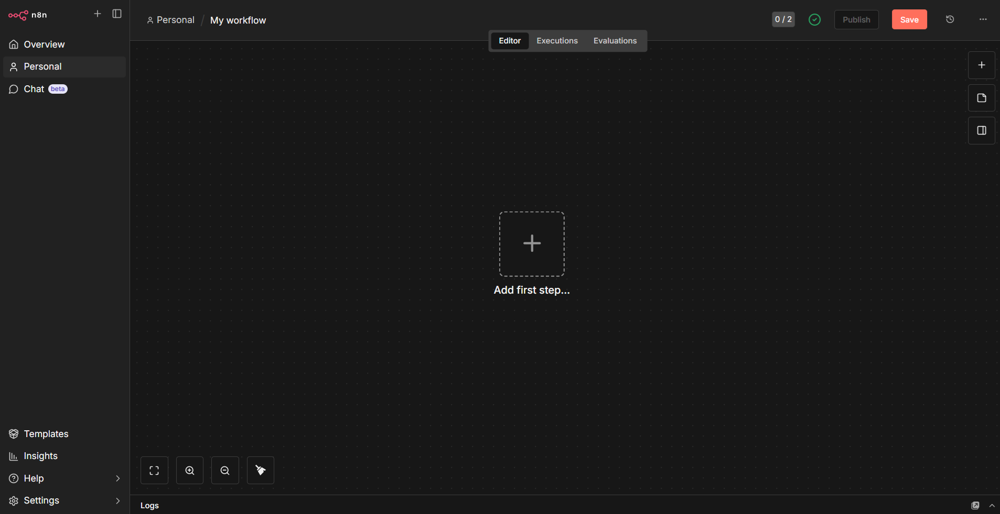
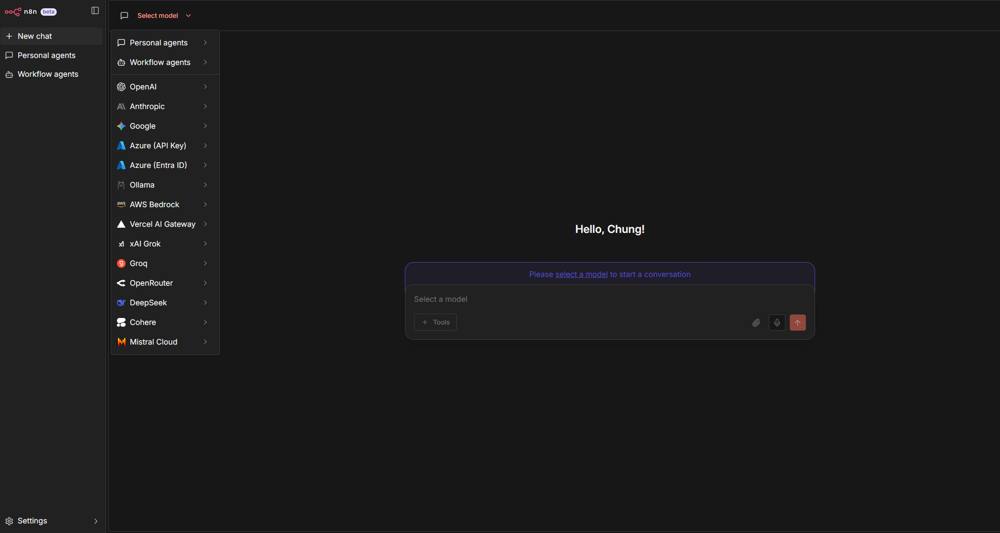
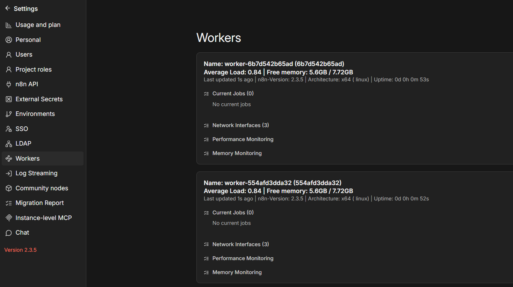
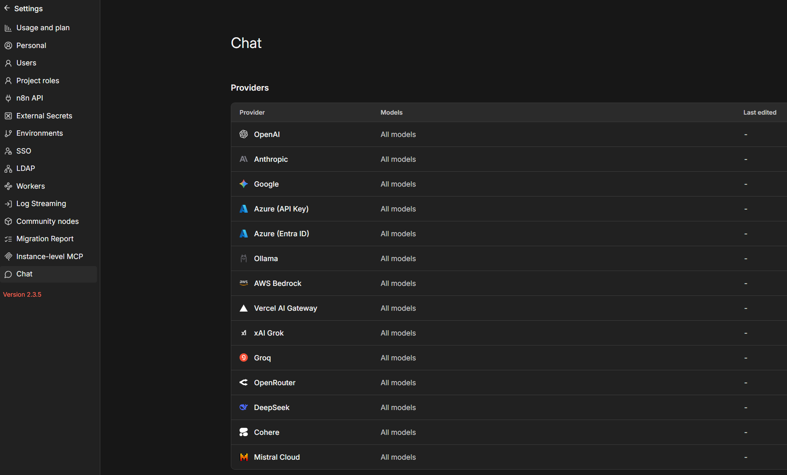
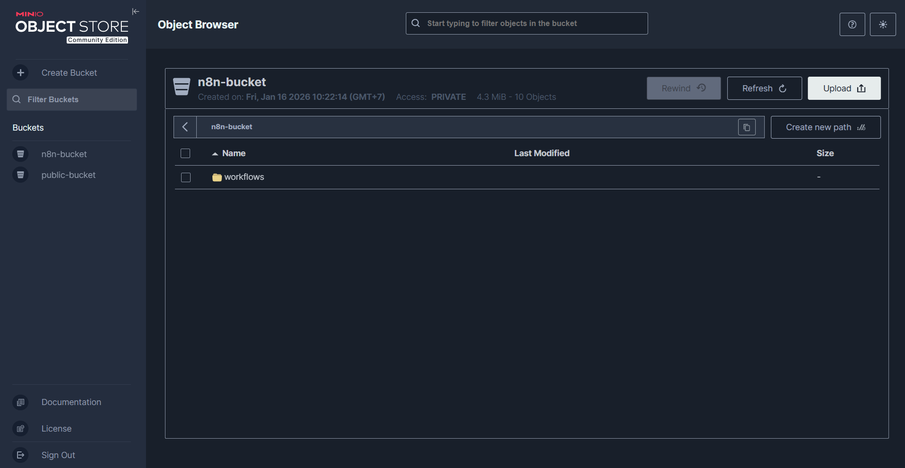
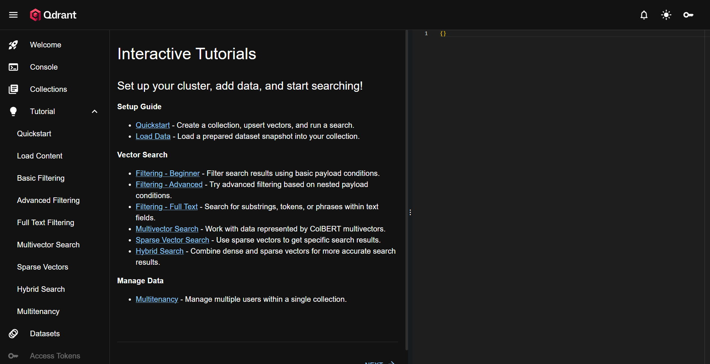

# N8n Production Stack (Extended)

Stack triển khai n8n production với kiến trúc queue mode, worker, webhook processor, runners, object storage, persistent database, reverse proxy SSL và các dịch vụ mở rộng (Browserless, Qdrant, NocoDB).

## Kiến trúc hệ thống

Mô hình triển khai `queue mode` tách biệt các thành phần để đảm bảo hiệu năng và khả năng mở rộng:

### Core Stack
- **n8n main** (UI + API): Giao diện quản lý và API server chính.
- **webhook**: Xử lý webhook inbound tách riêng để giảm latency và tải cho main node.
- **worker**: Xử lý background jobs từ queue.
- **runner**: Task executor môi trường sandbox (Python, JS), bảo mật và cô lập.
- **Redis**: Queue broker và caching.
- **PostgreSQL**: Database lưu trữ chính.
- **MinIO**: Object storage s3-compatible (lưu trữ file/binary).
- **Nginx**: Reverse proxy, SSL termination, routing.

### Extended Stack (Optional)
- **browserless**: Chrome headless cho các task scraping/automation.
- **qdrant**: Vector database cho AI/semantic search.
- **nocodb**: No-code database interface.

### Sơ đồ luồng dữ liệu

Checkout [System Architectures](./imgs/architect/)

## Chuẩn bị môi trường

- Docker ≥ 20.x, Docker Compose ≥ 2.x
- CPU: 4 cores, Memory: RAM 8GB+ (workload ~ 2 workers @ concurrency 8)
- Disk: SSD ≥ 50GB
- Network: SSL wildcard hoặc LetsEncrypt, Domain tách UI vs Gateway

### Docker & Docker compose
Install latest docker version:
```sh
curl -fsSL https://get.docker.com | sh
```

### DNS Records
Create an A/AAAA record for n8n host:

| Service | Domain | Scope |
|--------|--------|-------|
| n8n UI | `https://n8n.domain.local` | Private |
| n8n Gateway | `https://n8n-gw.domain.local` | Public |
| MinIO Console | `https://minio.domain.local` | Private |
| MinIO API | `https://minio-gw.domain.local` | Private |

Thay đổi cấu hình proxy tương ứng trong thư mục cấu hình [nginx](./nginx)
```sh
ls nginx/conf.d/*.conf
```

Tạo Self-signed Certificate dạng SSL Wildcard (hoặc copy nếu bạn đã có):
```
openssl req -x509 -nodes -days 3650 -newkey rsa:2048 \
  -keyout ./nginx/certs/private.key \
  -out ./nginx/certs/fullchain.pem \
  -subj "/C=VN/ST=Hanoi/L=Hanoi/O=IT/OU=LocalDev/CN=*.domain.local" \
  -addext "subjectAltName = DNS:*.domain.local, DNS:domain.local"
```

### Phân quyền thư mục
Chuẩn bị các folder sau và đảm bảo n8n có quyền đọc ghi:
```sh
mkdir -p n8n-data backup
chmod -R 777 n8n-data backup
```

## Quản trị dịch vụ

### Prepare services
Cấu hình các cài đặt và biến môi trường trong file [.n8n.env](./.n8n.env)
+ N8N_DEFAULT_BINARY_DATA_MODE
+ N8N_EDITOR_BASE_URL
+ N8N_ENCRYPTION_KEY
+ N8N_HOST
+ WEBHOOK_URL
+ N8N_EXTERNAL_STORAGE_S3_HOST
+ N8N_RUNNERS_AUTH_TOKEN
+ ...

```sh
vi .n8n.env
```

Kéo và build các docker image cần thiết để chuẩn bị dịch vụ

```sh
docker compose pull
docker compose build
```

### Base Stack
Khởi chạy bộ core dịch vụ (n8n, worker, webhook, db, redis, minio, nginx) cùng các dịch vụ mở rộng (đã được include tự động):

```sh
docker compose up -d --build
```

### Scaling Services
Hệ thống sử dụng mô hình **Paired Worker/Runner** để đảm bảo khả năng thực thi code an toàn và chính xác (tương thích yêu cầu của v2)

Mỗi `worker` (quản lý queue/broker) sẽ được ghép cặp với một `runner` (thực thi code sandbox) thông qua biến môi trường riêng biệt

Trong `docker-compose.yml`, có định nghĩa sẵn 2 cặp worker-runner:
- `worker-1` ↔ `runner-1`
- `worker-2` ↔ `runner-2`

Riêng dịch vụ **Webhook** (chỉ nhận traffic HTTP, không xử lý queue jobs) được scale độc lập thông qua cấu hình `replicas`:
```yaml
  webhook:
    deploy:
      mode: replicated
      replicas: 2 # Tăng giảm số lượng instance webhook tại đây
```

Để mở rộng thêm cặp Worker/Runner (Scale Out):
1. Copy block cấu hình của `worker-x` và `runner-x` trong file `docker-compose.yml`
2. Đổi tên thành `worker-3`, `runner-3`...
3. Cập nhật `N8N_RUNNERS_TASK_BROKER_URI` của runner mới trỏ về worker tương ứng

```yaml
  worker-3:
    <<: *worker-def
    container_name: worker-3

  runner-3:
    <<: *runner-def
    container_name: runner-3
    depends_on:
      - worker-3
    environment:
      - N8N_RUNNERS_TASK_BROKER_URI=http://worker-3:5679
```

### Custom Services
Các dịch vụ mở rộng được tách riêng trong thư mục `custom-services/` và được include tự động vào `docker-compose.yml`

Để tắt bớt dịch vụ không dùng (ví dụ `nocodb`), bạn có thể comment dòng tương ứng trong `docker-compose.yml`:

```yaml
include:
  - custom-services/browserless.yml
  - custom-services/qdrant.yml
  # - custom-services/nocodb.yml  <-- Comment để tắt
```

### Troubleshoot

Check docker compose logs
```sh
docker compose logs -f
```

Known issues:
+ `S3 binary data storage requires a valid license` -> change to use database storage
+ `There is a deprecation related to your environment variables` -> remove that environment
+ `EACCES: permission denied, open '/home/node/.n8n/nodes/package.json'` -> chmod -R 777 n8n-data
+ `Failed to connect to S3 for binary data storage. Please check your S3 configuration.` -> check for minio dns or hosts file

### Backup & Restore

Setup backup (crontab):
```sh
crontab scripts/n8n.cron
crontab -l
```

Backup manual:
```sh
bash scripts/backup.sh
```

Restore manual:
```sh
bash scripts/restore.sh
```

Check backup logs:
```sh
tail /var/log/n8n-backup.log
```

## Screenshots

| Img | Desc | Img | Desc |
|--------|--------|--------|--------|
|  | Chat space |  | Workflow space |
|  | Manage workers |  | Manage chat |
|  | Minio UI |  | Qdrant UI |

---

## License
GNU
